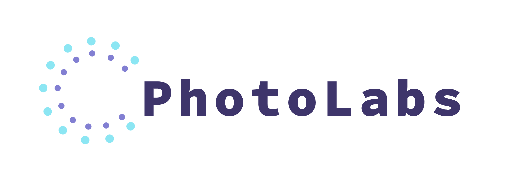
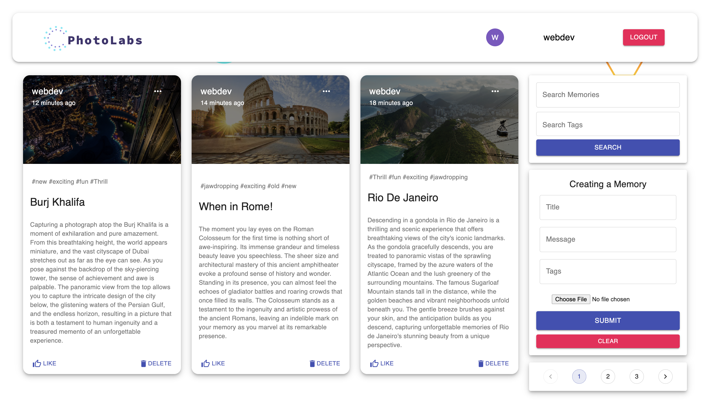
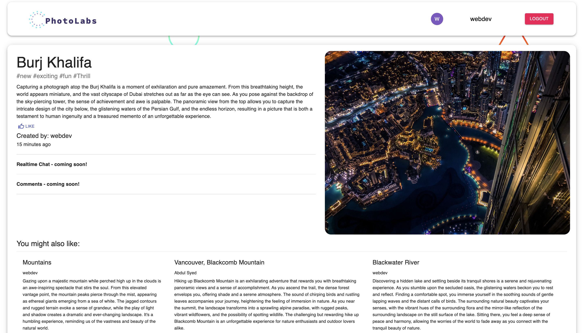
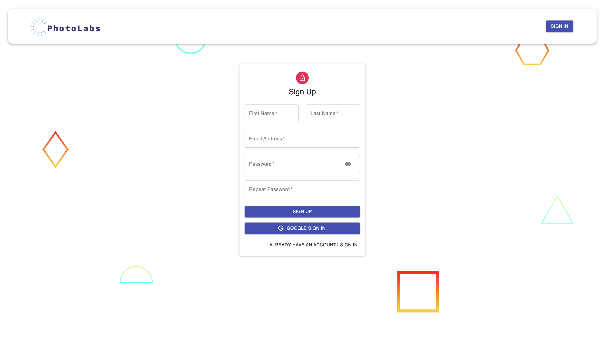

# PhotoLabs 


### PhotoLabs, where Users can add, delete, update, like and View each other's memories!

## Interface







## Mobile Interface


## Run Locally

- Run this command to clone repo

```
git clone git@github.com:syabdulr/snapshot.git
```
- run this command to start client page
```
cd client 
npm install
npm start
```
- run this command to start server (ensure you are in root directory of project)
```
cd server
npm install
npm start
```

## Features

- Authentication (Login/Signup) and with (Google)
- Create and Update Memories
- Like and Delete Memories
- View Other user's memories
- Recommended Posts
- Mobile Responsive
- Pagination
- Validation

## Tech Stack

- HTML5
- CSS3
- Javascript and ES+6
- Material-UI
- ReactJs
- Redux, Redux-Thunk
- NodeJs
- ExpressJs
- MongoDB Atlas

## Packages

- Frontend
- - axios
- - moment
- - redux
- - redux-thunk
- - @material-ui/core
- - @material-ui/icons
- - material-ui-chip-input
- - @material-ui/lab
- - react-file-base64
- - react-google-login (for google login feature)
- - jwt-decode (web tokens decoding)

- Backend
- - express
- - mongoose (for managing mongoDB)
- - cors
- - dotenv (for environment variables)
- - body-parser
- - nodemon
- - bcryptjs (for password hashing)
- - jsonwebtoken (for web tokens and sessions)

